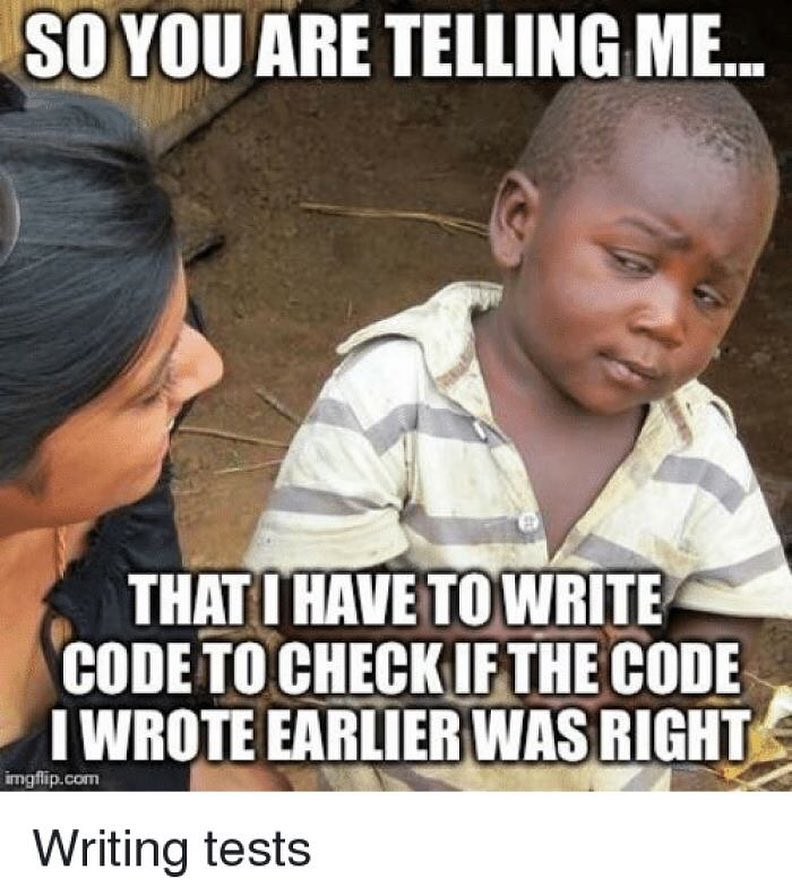
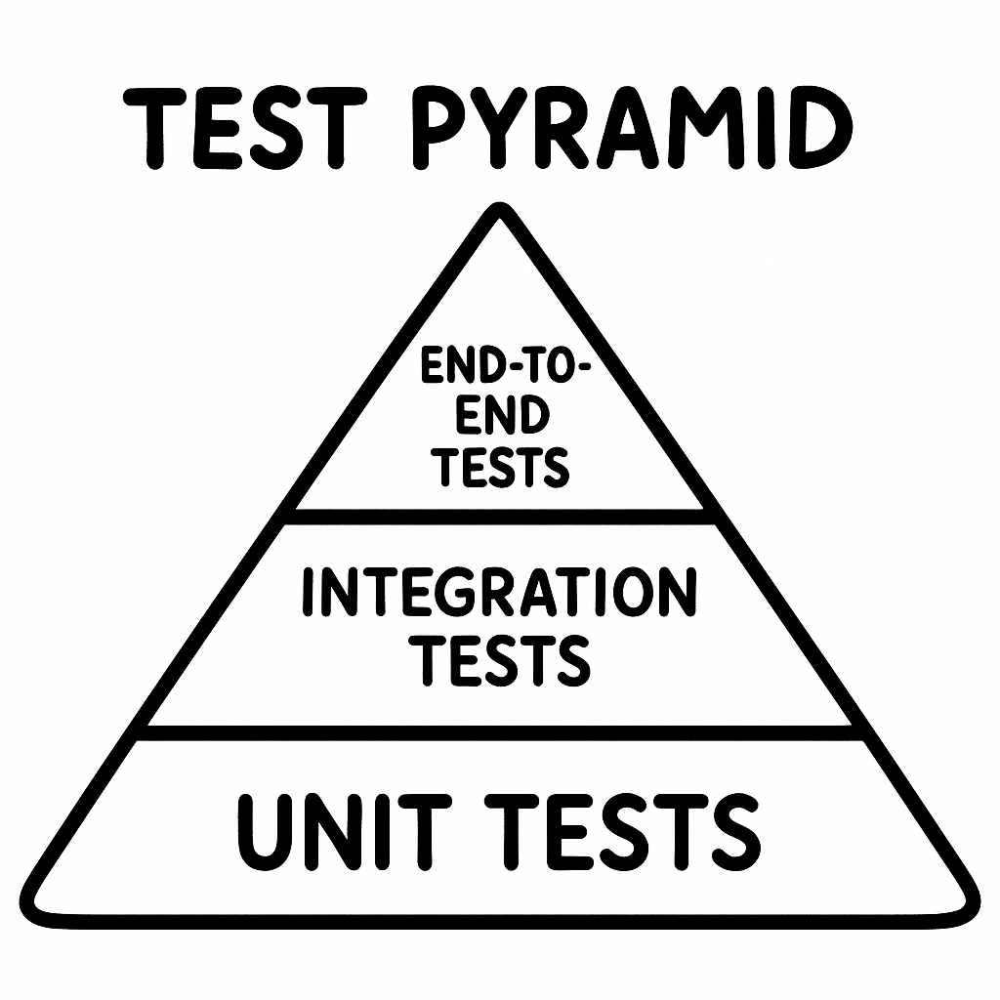
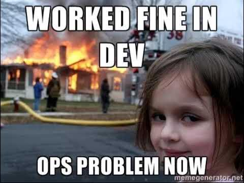

# 系統設計與分析 SAD 114-2

## 第十一週課程：DevOps（單元測試、Playwright、GitHub Actions）

### 助教：葉又銘、顧寬証，教授：盧信銘

> 詳細步驟與指令請搭配課程手冊：`/docs/week11`。

---

# 軟體測試：為什麼需要測試？

- **品質保證**：確保功能正常。
- **成本效益**：早期發現 Bug，降低維護成本。
- **穩定性**：提升使用者體驗，減少 Bug 回報。

---



---

### 測試類型

| 測試類型              | 說明                           |
| --------------------- | ------------------------------ |
| **單元測試**          | 測試單一功能或模組。           |
| **整合測試**          | 測試多個模組之間的互動。       |
| **端對端測試（E2E）** | 模擬使用者行為，測試整體系統。 |
| **性能測試**          | 測試系統在高負載下的表現。     |
| **安全測試**          | 測試系統的安全性與漏洞。       |
| **回歸測試**          | 確保新功能不影響舊功能。       |

---

## 測試計畫 (Test Plan)

測試計畫是組織與規劃軟體測試活動的文件，確保測試過程完整且有效。

### 測試計畫的重要元素

- **測試範圍**：定義測試的功能與特性。
- **測試策略**：描述測試的方法與層次。
- **測試環境**：指定測試執行的軟硬體環境。
- **測試排程**：測試活動的時間安排。
- **測試資源**：人力、工具與其他必要資源。

> 好的測試計畫能讓團隊更系統性、有效率地執行，避免遺漏重要功能測試。

---

## 單元測試 (Unit Testing)

### 什麼是單元測試？

單元測試是測試程式碼最小單位（通常是函數或方法）的功能是否符合預期。

### 單元測試的特點

- **獨立性**：測試不依賴其他單元或外部系統。
- **自動化**：可重複執行，無需人工干預。
- **快速**：執行時間通常很短。
- **精確**：失敗時，能精確定位問題所在。

---

### 單元測試範例 (使用 Jest)

### 單元測試最佳實踐

- **測試獨立性**：每個測試應獨立於其他測試。
- **測試覆蓋率**：盡可能覆蓋所有程式碼路徑。
- **模擬依賴**：使用 Mock 或 Stub 模擬外部依賴。
- **簡單明確**：每個測試只測試一個行為或功能。

```javascript
function add(a, b) {
  return a + b;
}
describe('數學函數測試', () => { 
  test('add 函數正確相加兩個數字', () => {
    expect(add(1, 2)).toBe(3);
});});
```

---

## 從使用者故事到自動化測試

### 1. 使用者故事 (User Story)

使用者故事是從使用者角度描述軟體功能的簡短陳述。

**例子**：「作為使用者，我希望能夠登入系統，以便使用個人化功能。」

- 使用者故事描述了使用者期望的功能與目的
- 成為測試的基礎需求
- 幫助團隊理解實際使用情境

---

### 2. 測試計畫轉換

將使用者故事轉換成測試計畫 **範例測試計畫 - Todo App**：

針對「新增待辦事項」功能：
- **測試案例**：驗證使用者能成功新增待辦事項
- **前置條件**：Todo App 已啟動
- **步驟**：輸入待辦事項、提交表單
- **預期結果**：待辦事項出現在清單中

---

### 3. 手動測試腳本

將測試計畫轉換為明確的手動步驟：

1. 開啟瀏覽器，前往登入頁面
2. 在「使用者名稱」欄位輸入有效帳號
3. 在「密碼」欄位輸入正確密碼
4. 點擊「登入」按鈕
5. 確認系統跳轉至儀表板頁面
6. 確認頁面上有歡迎訊息與使用者名稱

---

### 手動測試的價值

**軟體開發初期**，撰寫嚴謹的測試計畫並以手動測試嚴格遵行，是相當有效的品質保證方法：

- **靈活適應**：能夠快速適應不斷變化的需求和界面
- **主觀評估**：能夠對使用者體驗、視覺呈現進行人為判斷
- **探索性強**：測試人員可以發現規格外的問題和邊界情況
- **成本效益**：初期不需花費時間建立自動化框架

> 不需要執著於測試的自動化，在開發初期，嚴謹的手動測試計畫同樣能夠有效確保品質。

---

## 端對端測試 (E2E Testing)

### E2E 測試的特點

- **完整性**：測試整個應用流程，而非單一組件。
- **使用者視角**：站在使用者角度測試系統，實際使用者如何與應用互動。
- **涵蓋範圍**：測試系統所有組件的互動性。
- **執行時間**：通常比單元測試或整合測試慢。

### 常用的 E2E 測試工具

- **Playwright**：支援多瀏覽器，功能強大的 E2E 測試框架。
- **Cypress**：專為現代網頁應用設計的測試工具。
- **Selenium**：廣泛使用的跨平台測試框架。

---

### 4. 將手動腳本轉換為自動化腳本（自動化測試腳本）

**隨著專案規模成長**，自動化測試的價值逐漸突顯：

- **功能增加**：手動測試所有功能變得耗時且難以執行
- **頻繁迭代**：無法在每次程式碼變更後都進行完整手動測試
- **團隊效率**：釋放測試人員處理更高價值的探索性測試

> 當軟體規模逐漸龐大，無法每次開發新功能或改動程式碼就安排人力手動測試每個功能，自動化測試成為必要投資。

---

### E2E 測試最佳實踐

- **選擇關鍵流程**：專注於測試用戶關鍵路徑（如登入、購買流程）。
- **測試數據管理**：使用獨立的測試數據，避免影響生產環境。
- **並行執行**：配置測試能夠並行運行，減少執行時間。

---

## 測試金字塔



測試金字塔是一種視覺化測試策略的模型，從下到上：

- **底層：單元測試** - 數量最多，執行最快，成本最低
- **中層：整合測試** - 測試組件間的互動
- **頂層：E2E 測試** - 數量最少，執行最慢，但最接近真實使用者體驗

> 良好的測試策略應在各層級間取得平衡，根據專案需求調整比例

---

## 單元測試實作：Jest 入門

### Jest 簡介

Jest 是由 Facebook 開發的 JavaScript 測試框架，專為現代 Web 開發設計：

- **零配置**：開箱即用，無需複雜設定
- **內建功能**：斷言、模擬、覆蓋率報告等
- **隔離環境**：每個測試在獨立環境執行，避免相互影響

---

### Jest 安裝與設定

```bash
# 安裝 Jest
pnpm add -D jest

# 在 package.json 中設定測試指令
# "scripts": {
#   "test": "jest"
# }
```

---

### Jest 基本測試結構

```javascript
// 測試檔案命名通常為: 功能名.test.ts(x)，引入待測試的函數
import { sum, multiply } from './math';
// 測試套件（Test Suite）
describe('數學函數測試', () => {
  // 測試案例（Test Case）
  test('加法函數能正確相加兩個數字', () => {
    // 使用 expect 與 matcher 進行斷言
    expect(sum(1, 2)).toBe(3);
  });
  test('乘法函數能正確相乘兩個數字', () => {
    expect(multiply(2, 3)).toBe(6);
  });
});
```

---

### Jest 常用斷言（Matchers）

```javascript
// 相等性測試
expect(value).toBe(exactValue);       // 嚴格相等 (===)
expect(value).toEqual(object);        // 深度比較 (對物件有用)
// 真假值測試
expect(value).toBeTruthy();           // 轉換為 true
expect(value).toBeFalsy();            // 轉換為 false
// 數字比較
expect(value).toBeGreaterThan(3);     // 大於
expect(value).toBeLessThanOrEqual(1); // 小於等於
// 字串測試
expect(string).toMatch(/regex/);      // 符合正則表達式
// 陣列測試
expect(array).toContain('item');      // 包含項目
// 例外測試
expect(() => func()).toThrow();       // 拋出例外
```

---

### Jest 實作：Todo 函數測試

```javascript
// todo.js
export function addTodo(todos, text) {
  return [...todos, { id: Date.now(), text, completed: false }];
}

export function toggleTodo(todos, id) {
  return todos.map(todo => 
    todo.id === id ? { ...todo, completed: !todo.completed } : todo
  );
}
```

---

續上頁

```javascript
// todo.test.js
import { addTodo, toggleTodo } from './todo';
describe('Todo 功能測試', () => {
  test('能新增待辦事項', () => {
    const initialTodos = [];
    const newTodos = addTodo(initialTodos, '學習 Jest');
    expect(newTodos.length).toBe(1);
    expect(newTodos[0].text).toBe('學習 Jest');
    expect(newTodos[0].completed).toBe(false);
  });
  test('能切換待辦事項完成狀態', () => {
    const initialTodos = [{ id: 1, text: '學習測試', completed: false }];
    const updatedTodos = toggleTodo(initialTodos, 1);
    expect(updatedTodos[0].completed).toBe(true);
  });
});
```

---

### Jest 模擬（Mocks）

用於隔離測試單元，模擬外部依賴：

```javascript
// 模擬函數
const mockCallback = jest.fn();
mockCallback.mockReturnValue(42);  // 設定回傳值
jest.mock('./math');  // 自動模擬整個模組
// 模擬 API 請求
global.fetch = jest.fn(() => 
  Promise.resolve({
    json: () => Promise.resolve({ data: 'mocked data' })
  })
);
// 測試 API 請求函數
test('fetchTodos 應正確取得資料', async () => {
  const data = await fetchTodos();
  expect(data).toEqual({ data: 'mocked data' });
  expect(fetch).toHaveBeenCalledTimes(1);
});
```

---

### 執行 Jest 測試

```bash
# 執行所有測試
pnpm test
# 執行特定測試檔案
pnpm test -- todo.test.js
# 監視模式（變更時自動執行）
pnpm test -- --watch
# 生成覆蓋率報告
pnpm test -- --coverage
```

#### 自動化測試建議

1. **測試重要功能**：優先測試核心業務邏輯
2. **測試錯誤情況**：包含邊界值和例外處理
3. **保持測試獨立**：避免測試間的相互依賴
4. **持續整合**：配合 CI/CD 流程使用

---

## 現代軟體測試介紹：Playwright 入門

### Playwright 簡介

- **特點**：支援多瀏覽器、E2E 測試、直觀 API。
- **優勢**：開發社群、無頭模式（不用真的開瀏覽器）、直觀設計。

> 現在很多用 AI 操控瀏覽器的工具其實也是基於 Playwright，像是 Manus、Browser Use 等。

---

# 現在一起試試看吧！

> 記得把執行結果截圖當作今天的點名證明！

---

#### 安裝（詳細內容參考文件）

```bash
pnpm install -D @playwright/test
pnpm dlx playwright install
```

#### 測試範例

`tests/todo.spec.js`：

```javascript
import { test, expect } from "@playwright/test";
test("新增待辦事項", async ({ page }) => {
  await page.goto("http://localhost:3000");
  await page.fill('input[name="title"]', "學習");
  await page.click('button[type="submit"]');
  expect(await page.innerText(".todo-item")).toContain("學習");
});
```

執行：`pnpm test`（先確保剛剛使用 Docker 啟動了前端應用程式）

---

# DevOps



---

## DevOps 簡介

- **DevOps**：開發（Development）與運營（Operations）的結合。
- **目標**：提升軟體交付速度與品質。
- **文化**：強調團隊合作、持續改進與自動化。
- **工具**：CI/CD、容器化、監控等。
- **流程**：持續整合（CI）、持續交付（CD）、持續部署（CD）。
- **價值**：縮短開發週期、提高產品質量、增強團隊協作。
- **實踐**：自動化測試、持續交付、基礎設施即代碼（Infrastructure as Code）。

---

## CI/CD 實踐：GitHub Actions

### CI/CD 簡介

- **CI（持續整合）**：自動測試新程式碼。
- **CD（持續部署）**：測試通過後自動部署。
- **DevOps 角色**：提升交付速度與品質。

> 過去我們軟體交付速度慢，因此手動測試、部署並沒有什麼問題，但現在我們的軟體強調是快速迭代、敏捷開發，因此我們需要自動化測試與部署的流程，這樣才能快速地交付新的功能給使用者。

---

### CI/CD 流程

1. 開發者提交程式碼到 Git 儲存庫（例如 Push、Pull Request 等）。
2. 在合併前，CI 工具自動開始檢查程式碼，執行測試。
3. 測試通過後，CI 工具會通知開發者或直接合併程式碼。
4. 當程式碼合併到主分支後，CD 工具會自動將最新版本的應用程式部署到生產（Production）環境。
5. 部署完成後，CD 工具會通知相關人員，並提供部署狀態報告。
6. 若部署失敗，CD 工具會自動回滾到上個穩定版本，並通知相關人員。

---

### GitHub Actions

GitHub 提供的 CI/CD 工具：

1. 在專案新增 **Workflow 檔案**（`.github/workflows/ci.yml`）：
   ```yaml
   name: CI
   on: [push]
   jobs: （詳細請參考文件）
   ```
2. 推送後自動執行，檢查結果於 GitHub Actions 頁面。

---

# 試試看吧！

（詳細請參考教學文件）

1. 在 Todo App 專案中新增 GitHub Actions Workflow
2. 設定 CI/CD 流程
3. 測試自動化測試與部署
4. 修改程式碼，觀察 CI/CD 流程

---

## 總結與下一步

### 本週回顧（第十一週）

- **測試計畫與策略**：測試金字塔、單元測試與 E2E 的定位。
- **Jest**：單元測試實作與專案整合。
- **Playwright**：端對端測試入門。
- **GitHub Actions**：CI 與 workflow 基本概念。

### 與全學期課程的銜接

- **第三週**已涵蓋 Git / GitHub；**第六週**已涵蓋 Docker、Compose 與雲端原生部署；本週將 **DevOps 測試與自動化**收斂到可重複執行的流程。

---

# 感謝大家聆聽！

有任何問題或建議，歡迎隨時提出。

記得將實作結果截圖作為點名證明哦！
