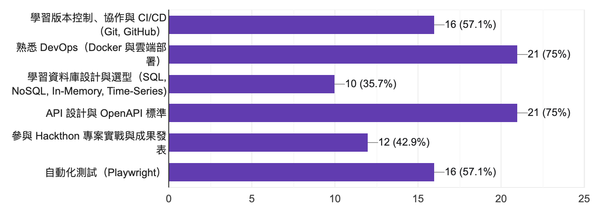
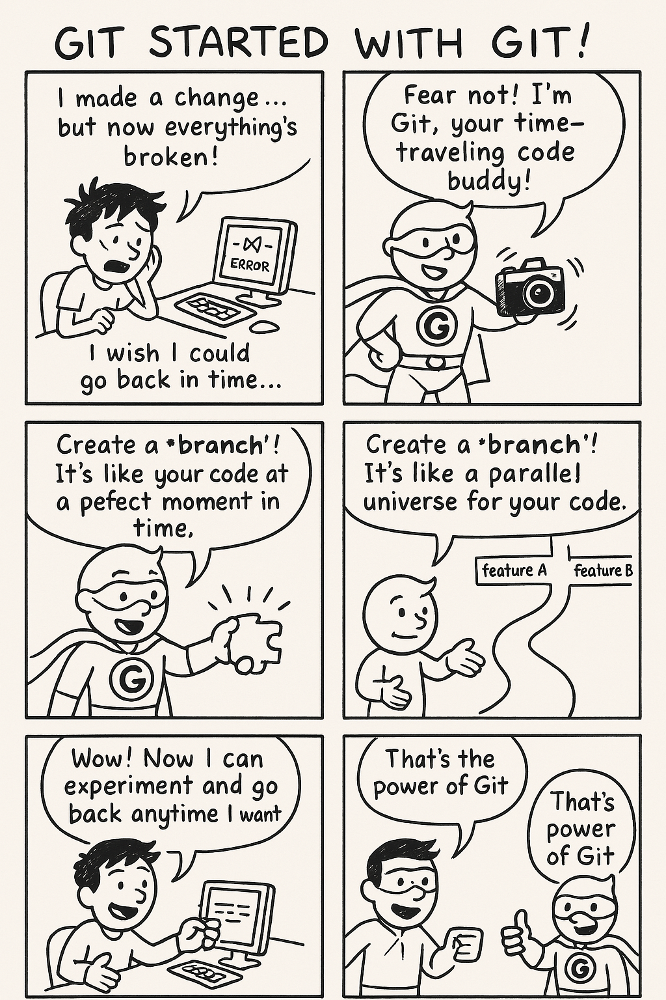
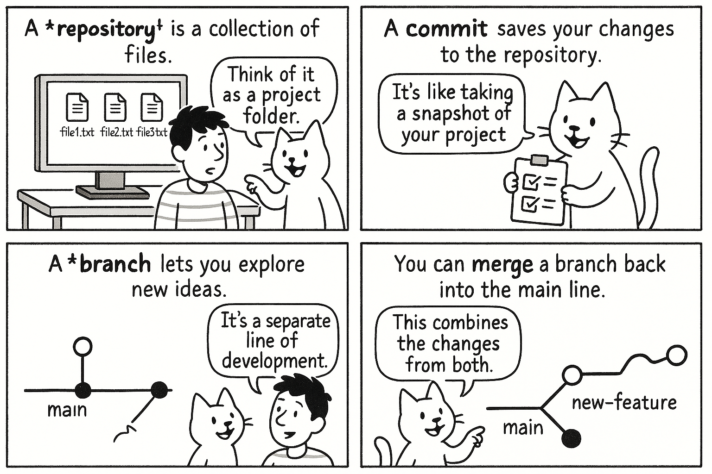
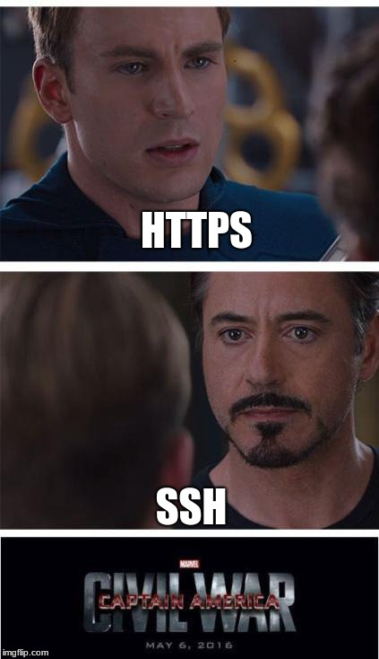
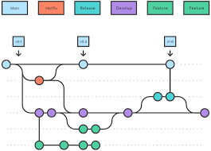

# 系統設計與分析 SAD 114-2

## 第三週課程：Version Control、Git 與 GitHub

### 助教：葉又銘、顧寬証，教授：盧信銘

---

## 課程目標

根據學期初的表單回饋，我們將著重於軟體開發流程、系統設計、DevOps 概念。



---

### 第三週（今天）

- **Git**：版本控制、分支與協作流程
- **GitHub**：遠端儲存庫、Pull Request、Code Review
- 安裝環境與 Fork **Todo App**，完成基本版控實作

### 第六週

- **Docker / Docker Compose**、**Registry**、多服務編排
- **雲端原生**概念與 **SSH 部署**

### 第十一週

- **測試計畫**、**Jest** 單元測試、**Playwright** E2E
- **GitHub Actions** 與 CI/CD 實務

---

## 第三週課程大綱

- **環境準備**：安裝必要工具與軟體
- 以 Todo App 為例，熟悉 **Git** 與 **GitHub** 協作流程（本週聚焦版控；容器與測試見第六週、第十一週）

> 你可以到課程內容下載這份簡報，你也可以順便打開我們附上的教學文件幫助你跟上腳步

---

## 環境準備

### 必要工具

1. **電腦**：Windows、Mac 或 Linux
2. **任一開發工具**
3. **任一瀏覽器**
4. **GitHub 帳號**
5. **Windows 用戶建議**：安裝 WSL 2（Windows Subsystem for Linux 2）
6. **Node.js**：下載並安裝 [Node.js](https://nodejs.org/)，通常會順便安裝 npm

---

# 先給大家一點時間安裝！

---

## Node.js?

Node.js 是一個開源的 JavaScript 「執行環境」，讓我們可以在伺服器端（Server Side）運行 JavaScript 程式碼。

過去我們只能在瀏覽器上運行 JavaScript，而 Node.js 就是讓我們可以「執行」 JavaScript 的工具，就好像是 Python 的 `python` 指令一樣。

> 簡單來說，Node.js 讓我們可以使用 JavaScript 開發伺服器端的應用程式！

---

## npm?

**NPM**（Node Package Manager）是 Node.js 的套件管理工具，讓我們可以輕鬆地安裝、更新和管理 JavaScript 套件。

### pnpm?

**pnpm** 是一款更高效、現代化的 Node.js 套件管理工具，本課程將使用它管理套件（packages、dependencies）。

> 總之就是現在的專案幾乎都是用 pnpm 來管理套件了，基本上指令幾乎跟 npm 一模一樣，使用 pnpm 會更快、更省空間。我們先來安裝吧！

---

#### pnpm 安裝指令

```bash
npm install -g pnpm
```

#### 驗證安裝

```bash
pnpm -v
```

#### 為什麼選 pnpm？

- **高效**：安裝速度快，節省磁碟空間。
- **兼容性**：支援 npm 指令，易於上手。
- **現代化**：適合 monorepo 等架構。（等一下會介紹！）
- 甚至有些開源專案已經不再支援 npm 了...

---

# 再給大家一些安裝時間

請大家現在安裝教學文件上說明的按照指示，安裝必要工具。

---

# Git


---

## Git 版本控制

### 為什麼需要 Git？

Git 是現代開發的核心工具，幫助我們：

- **版本管理**：追蹤程式碼變更，隨時回溯。
- **團隊協作**：多人同時開發不衝突。
- **分支開發**：獨立開發新功能或修復 Bug。

---



---

### Git 基本概念

- **Repository（儲存庫）**：程式碼與歷史記錄的存放處。
- **Commit（提交）**：記錄程式碼變更的快照（snapshot）。
- **Branch（分支）**：獨立開發路徑。
- **Merge（合併）**：整合不同分支的變更。

---



---

### Git 運作原理

Git 採用 **快照 (snapshot)** 機制管理版本，而非傳統的差異（diff）儲存。

#### 核心機制

1. **快照記錄**：
   - 每次 Commit，Git 記錄所有檔案的完整狀態。
   - 未變更的檔案只存指標，節省空間。
2. **物件模型**：
   - **Blob**：檔案內容。
   - **Tree**：目錄結構。
   - **Commit**：版本記錄（包含作者、時間等）。
3. **SHA-1 雜湊值**：
   - 每個物件有唯一識別碼（ID）

---

#### 比喻

想像 Git 是一台「智慧型時光相機」：

- 按下快門（Commit）記錄整個場景。
- 未變動部分重用舊照片，節省空間。
- 相簿（`.git` 目錄）用指紋（SHA-1）管理照片。

> `.git` 是在你的專案裡的隱藏資料夾，裡面存放著所有的版本控制資訊。
> 你可以用 `ls -a` 指令來查看這個資料夾，裡面有很多 Git 自己的檔案與資料夾。

---

### 安裝與設定 Git

#### 安裝

- **Windows**：下載 [Git](https://git-scm.com/download/win)，包含 Git Bash。
- **Mac**：`brew install git`
- **Linux**：`sudo apt install git`
- 驗證：`git --version`

#### 基本設定

```bash
git config --global user.name "你的名稱"
git config --global user.email "你的Email"
```

> Git 會使用這些資訊來標記你的提交紀錄，讓其他人知道這些變更是由誰做的。

檢查：`git config --list`

---

# GitHub


---

## GitHub 簡介

GitHub 是一個基於 Git 的雲端儲存庫平台，提供版本控制、協作開發和社群功能。

- **版本控制**：儲存與管理程式碼歷史。
- **協作開發**：多人同時開發，透過 Pull Request 進行程式碼審查。
- **社群功能**：問題（Issues）、Wiki、專案管理等。
- **開源專案**：支援開源專案，促進社群貢獻。
- **CI/CD**：整合 GitHub Actions，自動化測試與部署。（等一下會介紹！）

---

## SSH 設定

### 為什麼使用 SSH？

讓 GitHub 與本地端安全連線，避免每次推送都要輸入帳號密碼（現在 GitHub 也不支援直接輸入密碼登入了），尤其是當你使用雲端機器時。

> 通常在雲端機器上不會使用 HTTPS 連線，因為這樣會需要每次都輸入帳號密碼，甚至 GitHub 還要求你使用 Token 來登入，這樣會更麻煩。

---



---

### SSH 設定步驟

1. 生成金鑰：
   ```bash
   ssh-keygen -t rsa -b 4096 -C "你的Email"
   ```
2. 添加公鑰至 GitHub：
   - 查看公鑰：`cat ~/.ssh/id_rsa.pub`
   - 在 [GitHub SSH 設定](https://github.com/settings/keys) 添加。
3. 測試連線：
   ```bash
   ssh -T git@github.com
   ```

> ssh-keygen 會生成兩個檔案，`id_rsa` 是私鑰，`id_rsa.pub` 是公鑰。私鑰要保密，公鑰可以分享給 GitHub。私鑰會用來加密你的連線，而公鑰則是用來讓 GitHub 驗證你的身份。

---

# 實作時間

設定完記得截圖作為今天點名的證明！

---

### Git Flow：分支管理實踐

**Git Flow** 是一種 Git Branching Model（分支模型），是十幾年前提出的 Git 協作流程。

> 現在，根據不同的專案需求，Git Flow 也有很多變種，像是 GitHub Flow、GitLab Flow 等等。

#### 分支模型

- **Main**：正式發布版本。 **(永遠是可部署狀態)**
- **Develop**：開發中的程式碼。 **(整合所有功能)**
- **Feature**：新功能開發分支。 **(從 Develop 分出)**
- **Release**：準備發布的版本。 **(從 Develop 分出，用於測試與修復)**
- **Hotfix**：緊急修復分支。 **(從 Main 分出，修復線上 Bug)**

---


---

#### 各分支詳解

- **Main (Master)**:
  - 代表 **穩定、已發布** 的版本。
  - 只接受來自 `Release` 或 `Hotfix` 分支的合併。
  - **嚴禁** 直接在此分支開發。
- **Develop**:
  - **整合** 所有已完成的功能 (`Feature`)。
  - 是 `Feature` 和 `Release` 分支的基礎。
  - 代表 **下一個版本** 的開發狀態。

---

#### 各分支詳解 (續)

- **Feature**:

  - 用於開發 **新功能**。
  - **必須** 從 `Develop` 分支出來。
  - 完成後 **必須** 合併回 `Develop`。
  - 命名建議：`feature/功能名稱` (e.g., `feature/user-login`)。
    > 但其實現在很多開源專案都不會限制命名規則了～

- **Release**:
  - 用於 **準備發布** 新版本。
  - 從 `Develop` 分支出來。
  - 在此分支進行 **測試、Bug 修復、版本號更新**。
  - 完成後 **同時合併** 回 `Main` (標記版本) 和 `Develop` (同步修復)。

---

- **Hotfix**:
  - 用於 **緊急修復** `Main` 分支上的 Bug。
  - **必須** 從 `Main` 分支出來。
  - 完成後 **同時合併** 回 `Main` 和 `Develop`。

> 以上是 Git Flow 的基本概念，實際上有些團隊會根據需求調整流程，但大致上都是這樣的運作方式就是了。

---

#### 分支圖示



---

#### Git Flow 協作流程

1.  **開始新功能**：從 `Develop` 建立 `feature/新功能` 分支。
2.  **開發與提交**：在 `feature` 分支上開發，頻繁提交變更。
3.  **完成功能**：將 `feature` 分支合併回 `Develop`。
4.  **準備發布**：當 `Develop` 累積足夠功能後，從 `Develop` 建立 `release/版本號` 分支。
5.  **測試與修復**：在 `release` 分支上進行測試，只做 Bug 修復。
6.  **正式發布**：
    - 將 `release` 分支合併到 `Main`，並打上版本標籤 (Tag)。
    - 將 `release` 分支合併回 `Develop`，確保修復也納入開發主線。
7.  **緊急修復**：若 `Main` 出現 Bug，從 `Main` 建立 `hotfix/問題描述` 分支，修復後合併回 `Main` 和 `Develop`。

---

### Git Flow 實戰場景：新增待辦事項截止日期

#### 角色

- **小明**：新加入的開發者
- **Senior Lin**：資深開發者，負責 Code Review
- **PM Chen**：專案經理，提出需求

#### 需求

PM Chen 希望在 Todo App 中為每個待辦事項增加「截止日期」功能。

---

#### 場景步驟 1：準備開發

1.  **PM Chen**：在專案管理工具 (如 Jira, GitHub Issues) 開立新任務：「新增待辦事項截止日期」。
2.  **小明**：接下任務，先確保本地 `develop` 分支是最新狀態。
    ```bash
    git checkout develop
    git pull origin develop
    ```
3.  **小明**：從 `develop` 分支建立新的 `feature` 分支。
    ```bash
    git checkout -b feature/add-due-date develop
    # 分支名稱清晰表達功能目的
    ```

---

#### 場景步驟 2：開發與提交

1.  **小明**：在 `feature/add-due-date` 分支上開發新功能（修改程式碼、加入 UI 元素等）。
2.  **小明**：開發過程中，進行多次小步提交 (Commit)。
    ```bash
    # 修改檔案 ...
    git add .
    git commit -m "feat: add due date input field"
    # 繼續修改檔案 ...
    git add .
    git commit -m "feat: implement due date saving logic"
    ```
3.  **小明**：功能初步完成後，將本地分支推送到遠端儲存庫 (GitHub)。
    ```bash
    git push origin feature/add-due-date
    ```

---

#### 場景步驟 3：建立 Pull Request (PR)

1.  **小明**：前往 GitHub 儲存庫頁面，針對 `feature/add-due-date` 分支，點擊「Create Pull Request」。
2.  **設定 PR**：
    - **Base Branch**：`develop` (要合併到的目標分支)
    - **Compare Branch**：`feature/add-due-date` (包含新功能的分支)
    - **標題**：清晰描述 PR 的目的 (e.g., "Feat: Add Due Date Feature")
    - **描述**：說明變更內容、如何測試、關聯的任務編號等。
    - **Reviewers**：指派 **Senior Lin** 進行 Code Review。

---

#### 場景步驟 4：Code Review 與合併

1.  **Senior Lin**：收到 PR 通知，檢視小明的程式碼變更。
2.  **討論與修改 (可能發生)**：
    - Senior Lin 可能會提出建議或要求修改，在 PR 頁面留言。
    - 小明 根據回饋，在本地 `feature/add-due-date` 分支修改程式碼，再次 commit 並 push。PR 會自動更新。
3.  **批准 PR**：Senior Lin 對程式碼滿意後，點擊「Approve」。
4.  **合併 PR**：
    - Senior Lin (或 小明，取決於團隊權限設定) 點擊「Merge Pull Request」。
5.  **刪除分支 (可選)**：合併後，可以安全地刪除遠端和本地的 `feature/add-due-date` 分支。

---

#### 場景總結

- **PM Chen**：追蹤任務狀態
- **小明**：透過 Git Flow 貢獻了新功能
- **Senior Lin**：確保了程式碼品質

這個流程確保了新功能在獨立分支開發，經過審查後才合併，降低了直接修改主開發線的風險，也讓進度追蹤變得清楚。

---

# 試試看吧！

（詳細請參考教學文件）

1. Fork Todo App 專案：https://github.com/114-2-SAD/SADo
2. Clone 你的專案到本地端：`git clone git://<your-github-username>/SADo.git`
3. 從 `develop` 分支建立 `feature/your-feature-name` 分支
4. 隨意修改一行程式碼
5. 使用 `git add`、`git commit` 提交變更
6. Push 到 GitHub
7. 建立 Pull Request，並指派給自己
8. 等待自己 Code Review
9. 合併 PR，刪除分支

---
